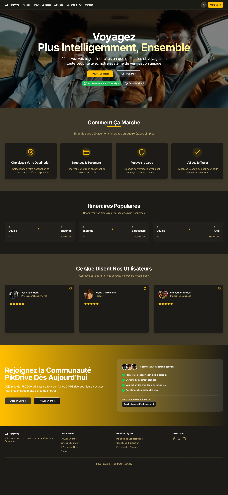
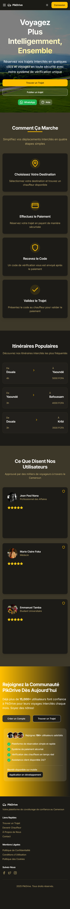

# Pikdrive

A modern ride-sharing and transportation platform connecting drivers and passengers.

[](https://pikdrive.com)

**Live Website:** [https://pikdrive.com](https://pikdrive.com)



## Overview

Pikdrive is a comprehensive ride-sharing application built with Next.js, offering a seamless experience for both riders and drivers. The platform facilitates ride bookings, payments, and driver-passenger matching with real-time updates and notifications.

## Features

- **User Authentication** - Secure login and registration with Supabase Auth (phone OTP)
- **Ride Booking** - Easy and intuitive ride scheduling with pickup point selection
- **Driver Dashboard** - Dedicated section for drivers to manage rides, bookings, and payouts
- **Real-time Chat** - In-app messaging between drivers and passengers
- **Mobile-First Design** - Responsive interface optimized for all devices
- **PWA Support** - Install as a native app on mobile devices
- **Payment Integration** - PawaPay, MTN MoMo, and Orange Money with automatic provider routing
- **Driver Payouts** - Automated driver payouts on code verification with fee calculation
- **Partial Refunds** - Seat reduction with automatic refund processing
- **Review System** - Two-way reviews (passenger ↔ driver) with rating aggregation
- **Multi-Channel Notifications** - OneSignal push + WhatsApp Business API
- **Cron Jobs** - Automated review requests and pending payment checks

## Tech Stack

- **Frontend Framework:** Next.js 14 (App Router)
- **UI Components:** Radix UI with Tailwind CSS
- **Authentication:** Supabase Auth
- **Database:** Supabase PostgreSQL
- **State Management:** Zustand + React Context API
- **Payments:** PawaPay (primary), MTN MoMo, Orange Money
- **Notifications:** OneSignal (push) + WhatsApp Business API (templates)
- **Styling:** Tailwind CSS with shadcn/ui
- **Internationalization:** next-intl (French / English)
- **Deployment:** Vercel (with daily cron jobs)

## Screenshots

### Desktop View


### Mobile View



## Installation and Setup

### Prerequisites

- Node.js 18+
- npm or yarn
- Supabase account

### Local Development

1. Clone the repository

```bash
git clone https://github.com/JospenWolongwo/pickdrive.git
cd pickdrive
```

2. Install dependencies

```bash
npm install
```

3. Set up environment variables

```bash
cp .env.local.example .env.local
```

Fill in the values in `.env.local`. See `.env.local.example` for the full list of variables with descriptions.

4. Run the development server

```bash
npm run dev
```

5. Open [http://localhost:3000](http://localhost:3000) in your browser

6. **(Optional)** Seed city pickup points (precise public places per city). Requires `SUPABASE_SERVICE_ROLE_KEY` in `.env.local`. You can edit or add more via the admin dashboard after seeding.

```bash
npm run seed:pickup-points
```

## Deployment

The application is deployed on Vercel and can be accessed at [https://pikdrive.com](https://pikdrive.com).

## Progressive Web App

Pikdrive is a Progressive Web App that can be installed on mobile devices:

- On iOS, use the "Add to Home Screen" option in Safari
- On Android, tap "Install App" when prompted or use the browser menu

## Contributing

1. Fork the repository
2. Create your feature branch (`git checkout -b feature/amazing-feature`)
3. Commit your changes (`git commit -m 'Add some amazing feature'`)
4. Push to the branch (`git push origin feature/amazing-feature`)
5. Open a Pull Request

## Contact

- **Developer**: Jospen Wolongwo
- **Email**: [jospenwolongwo@gmail.com](mailto:jospenwolongwo@gmail.com)
- **Website**: [jospenwolongwo.com](https://jospenwolongwo.com)
- **GitHub**: [JospenWolongwo](https://github.com/JospenWolongwo)

## License

This project is licensed under the MIT License.
