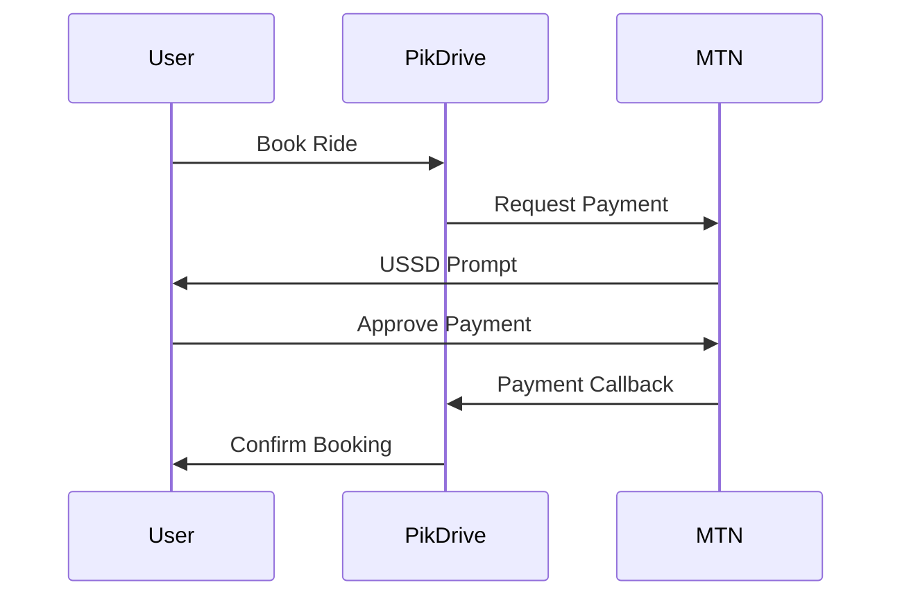

# MTN Mobile Money Integration Guide

## Overview
This document outlines the integration of MTN Mobile Money (MOMO) into PikDrive's payment system. MTN MOMO is used for processing payments in Cameroon, allowing users to pay for rides using their mobile money accounts.

## Prerequisites

### MTN MOMO API Credentials
You need to obtain the following credentials from MTN:
- Subscription Key: `MOMO_SUBSCRIPTION_KEY`
- Collection Primary Key: `MOMO_COLLECTION_PRIMARY_KEY`
- Collection User ID: `MOMO_COLLECTION_USER_ID`
- API Key: `MOMO_API_KEY`

### Environment Setup
Add these variables to your `.env` file:
```env
MOMO_SUBSCRIPTION_KEY=your-subscription-key
MOMO_COLLECTION_PRIMARY_KEY=your-collection-primary-key
MOMO_COLLECTION_USER_ID=your-collection-user-id
MOMO_API_KEY=your-api-key
MOMO_TARGET_ENVIRONMENT=sandbox
MOMO_CALLBACK_HOST=https://your-callback-url.com
```

## Sandbox Testing

### 1. Create Test Account
1. Visit MTN MOMO Developer Portal
2. Register for a sandbox account
3. Note down your test phone numbers and PIN

### 2. Test Numbers Format
- Test numbers should be in format: `+237XXXXXXXXX`
- Default PIN for test accounts: `0000`

### 3. Test Scenarios
Test the following scenarios:
- Successful payment
- Insufficient balance
- Cancelled payment
- Network timeout
- Invalid PIN (3 attempts)

## Production Setup

### 1. API Access
To get production access:
1. Complete sandbox testing
2. Submit production access request to MTN
3. Provide your production callback URL
4. Get production API credentials

### 2. Security Requirements
- SSL certificate for callback URL
- IP whitelisting
- Webhook signature validation
- Rate limiting implementation

### 3. Callback URL
Your callback URL must:
- Be publicly accessible
- Use HTTPS
- Handle POST requests
- Validate signatures
- Return 200 OK for valid callbacks

## Implementation Details

### 1. Payment Flow


### 2. Error Handling
Common error codes:
- `PAYEE_NOT_FOUND`: Invalid phone number
- `PAYER_INSUFFICIENT_FUNDS`: Not enough balance
- `TIMEOUT`: Request timeout
- `PENDING`: Transaction in progress
- `FAILED`: General failure

### 3. Testing Checklist
- [ ] Basic payment flow
- [ ] Phone number validation
- [ ] Payment status updates
- [ ] Callback handling
- [ ] Error scenarios
- [ ] Transaction logging
- [ ] Security measures

## Monitoring

### 1. Key Metrics
Monitor these metrics:
- Transaction success rate
- Average processing time
- Error frequency by type
- API response times
- Callback success rate

### 2. Logging
Log these events:
- Payment requests
- Status changes
- Callback receipts
- Error occurrences
- User interactions

## Support

### MTN MOMO Support
- Technical Support: support@momodeveloper.mtn.com
- API Documentation: https://momodeveloper.mtn.com/docs
- Status Page: https://momodeveloper.mtn.com/status

### Internal Support
For internal issues:
1. Check logs in Supabase
2. Verify payment records
3. Check callback logs
4. Review error tracking

## Next Steps
1. [ ] Complete sandbox testing
2. [ ] Implement production security measures
3. [ ] Set up monitoring
4. [ ] Document error handling procedures
5. [ ] Train support team

## Notes
- All amounts are in XAF (FCFA)
- Phone numbers must be in international format
- Transactions expire after 30 minutes
- Keep API keys secure and rotate regularly
