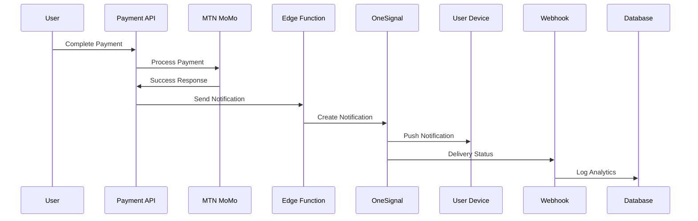

# PikDrive Notification Integration Plan
## Professional, Scalable, Multi-Service Notification System

---

## 🎯 **Architecture Overview**

### **Inspired By:**
- **Uber**: Real-time ride notifications with location updates
- **DoorDash**: Order status notifications with ETA
- **Wave/MTN MoMo**: Payment confirmation with transaction details
- **WhatsApp**: Message notifications with sound customization

### **Core Principles:**
1. **Separation of Concerns**: Each service has one responsibility
2. **Reusability**: One notification system for all features
3. **Type Safety**: Full TypeScript support
4. **Performance**: Optimized for mobile and web
5. **UX First**: Clear, timely, non-intrusive notifications

---

## 📁 **Folder Structure (Clean Architecture)**

```
lib/
├── notifications/
│   └── onesignal-client.ts          # OneSignal SDK wrapper
│
hooks/
├── notifications/
│   ├── useOneSignal.ts               # OneSignal initialization hook
│   ├── useNotificationPermission.ts  # Permission management
│   └── useNotificationSound.ts       # Sound management
│
services/
├── notification-service.ts           # Client-side notification API
│
public/
└── sounds/
    └── notifications/
        ├── payment-success.wave       # Payment completed
        ├── booking-confirmed.wave     # Booking confirmed
        ├── new-message.wave           # New message
        └── ride-starting.wave         # Driver arriving
```

---

## 🔔 **Notification Types & Use Cases**

### **1. Booking Notifications**
```typescript
// When: Booking status changes
{
  type: 'booking_confirmed',
  title: 'Booking Confirmed! 🎉',
  message: 'Your ride from Douala to Yaoundé is confirmed for Jan 31 at 10:00 AM',
  data: {
    bookingId: 'xxx',
    rideId: 'xxx',
    driverName: 'Jean Dupont',
    departureTime: '2025-01-31T10:00:00Z'
  },
  sound: 'booking-confirmed.wave',
  action: '/bookings/:id'
}
```

### **2. Payment Notifications**
```typescript
// When: Payment status changes
{
  type: 'payment_success',
  title: 'Payment Successful ✅',
  message: 'Payment of 5,000 XAF received. Your seats are reserved!',
  data: {
    paymentId: 'xxx',
    amount: 5000,
    transactionId: 'xxx',
    provider: 'mtn'
  },
  sound: 'payment-success.wave',
  action: '/receipts/:id'
}

{
  type: 'payment_failed',
  title: 'Payment Failed ❌',
  message: 'Payment could not be processed. Please try again.',
  data: {
    paymentId: 'xxx',
    reason: 'Insufficient funds'
  },
  sound: 'payment-failed.wave',
  action: '/payments/retry/:id'
}
```

### **3. Message Notifications**
```typescript
// When: New message received
{
  type: 'new_message',
  title: 'New Message from Jean Dupont',
  message: 'I\'ll be there in 5 minutes!',
  data: {
    conversationId: 'xxx',
    senderId: 'xxx',
    senderName: 'Jean Dupont',
    messagePreview: 'I\'ll be there in 5 minutes!'
  },
  sound: 'new-message.wave',
  action: '/messages/:conversationId'
}
```

### **4. Driver/Ride Notifications**
```typescript
// When: Driver is approaching
{
  type: 'driver_arriving',
  title: 'Driver Arriving Soon 🚗',
  message: 'Jean Dupont will arrive in 10 minutes. Get ready!',
  data: {
    bookingId: 'xxx',
    driverId: 'xxx',
    driverName: 'Jean Dupont',
    estimatedArrival: '10 minutes'
  },
  sound: 'ride-starting.wave',
  action: '/bookings/:id'
}
```

---

## 🎵 **Notification Sounds (Professional Quality)**

### **Where to Get Sounds:**
1. **Freesound.org** (CC0 License - Free for commercial use)
2. **Zapsplat.com** (Free sound effects)
3. **Notification Sounds** (iOS/Android standard sounds)

### **Sound Recommendations:**
```typescript
const NOTIFICATION_SOUNDS = {
  // Payment sounds (confident, reassuring)
  payment_success: 'payment-success.wave',    // Positive chime
  payment_failed: 'payment-failed.wave',      // Subtle alert
  
  // Booking sounds (excited, celebratory)
  booking_confirmed: 'booking-confirmed.wave', // Success jingle
  booking_cancelled: 'booking-cancelled.wave', // Neutral tone
  
  // Message sounds (friendly, non-intrusive)
  new_message: 'new-message.wave',            // Gentle pop
  
  // Ride sounds (urgent but not alarming)
  driver_arriving: 'ride-starting.wave',      // Alert tone
  ride_started: 'ride-started.wave',          // Start chime
  ride_completed: 'ride-completed.wave'       // Completion sound
};
```

### **Sound Specifications:**
- **Format**: wave (best compatibility)
- **Duration**: 0.5-2 seconds (not annoying)
- **Volume**: Normalized to -16 LUFS
- **Size**: < 50KB each

---

## 🔄 **Notification Flow (End-to-End)**

### **Example: Payment Success Flow**



### **Code Flow:**

```typescript
// 1. Server-side: Payment completed
await notificationService.sendPaymentNotification(userId, {
  type: 'payment_success',
  paymentId: payment.id,
  amount: payment.amount
});

// 2. Edge Function: Formats and sends
const notification = {
  userId: userId,
  title: getNotificationTitle('payment_success'),
  message: getNotificationMessage('payment_success', { amount }),
  data: { paymentId, amount },
  notificationType: 'payment_success'
};

// 3. OneSignal: Delivers to user
// 4. Client: Plays sound and shows notification
// 5. Webhook: Tracks delivery and clicks
```

---

## 🎨 **Client-Side Integration**

### **1. Initialize OneSignal (app/layout.tsx)**
```typescript
'use client';

import { useOneSignal } from '@/hooks/notifications/useOneSignal';
import { useEffect } from 'react';

export default function RootLayout({ children }) {
  const { initialize, isInitialized } = useOneSignal();
  
  useEffect(() => {
    initialize();
  }, []);

  return (
    <html>
      <body>{children}</body>
    </html>
  );
}
```

### **2. Request Permission (Settings Page)**
```typescript
'use client';

import { useNotificationPermission } from '@/hooks/notifications/useNotificationPermission';

export function NotificationSettings() {
  const { 
    permission, 
    isSubscribed, 
    requestPermission 
  } = useNotificationPermission();

  return (
    <div>
      {!isSubscribed && (
        <button onClick={requestPermission}>
          Enable Notifications
        </button>
      )}
    </div>
  );
}
```

### **3. Handle Notification Click**
```typescript
// Automatically redirects user to relevant page
OneSignal.Notifications.addEventListener('click', (event) => {
  const { action, bookingId, paymentId } = event.notification.data;
  router.push(action || `/bookings/${bookingId}`);
});
```

---

## 🔐 **Security Best Practices**

### **1. API Keys**
- ✅ **Server-side only**: API keys in Edge Functions
- ❌ **Never in client**: No API keys in frontend code
- ✅ **Environment variables**: Secure storage in `.env.local`

### **2. User Data**
- ✅ **User ID only**: Use Supabase auth.uid() as external user ID
- ❌ **No PII**: Never send sensitive data in notifications
- ✅ **Data encryption**: Use HTTPS everywhere

### **3. Rate Limiting**
- ✅ **Debouncing**: Prevent duplicate notifications
- ✅ **Throttling**: Limit notifications per user per hour
- ✅ **Priority**: Critical notifications only

---

## 📊 **Analytics & Monitoring**

### **Metrics to Track:**
1. **Delivery Rate**: % of notifications delivered
2. **Click Rate**: % of notifications clicked
3. **Opt-in Rate**: % of users who enable notifications
4. **Time to Delivery**: Average delivery time
5. **Error Rate**: Failed notifications

### **Queries:**
```sql
-- Delivery rate by type
SELECT 
  notification_type,
  COUNT(*) as sent,
  SUM(CASE WHEN status = 'delivered' THEN 1 ELSE 0 END) as delivered,
  ROUND(100.0 * SUM(CASE WHEN status = 'delivered' THEN 1 ELSE 0 END) / COUNT(*), 2) as delivery_rate
FROM notification_logs
GROUP BY notification_type;

-- Click rate
SELECT 
  notification_type,
  SUM(CASE WHEN clicked_at IS NOT NULL THEN 1 ELSE 0 END) as clicks,
  COUNT(*) as total,
  ROUND(100.0 * SUM(CASE WHEN clicked_at IS NOT NULL THEN 1 ELSE 0 END) / COUNT(*), 2) as click_rate
FROM notification_logs
GROUP BY notification_type;
```

---

## 🚀 **Implementation Phases**

### **Phase 1: Foundation (Current)**
- ✅ OneSignal account setup
- ✅ Edge Function deployed
- ✅ Database tables created
- ✅ Webhook endpoint ready

### **Phase 2: Client Integration (Next)**
- [ ] Download notification sounds
- [ ] Create client-side services
- [ ] Integrate OneSignal SDK
- [ ] Test notification flow

### **Phase 3: Payment Integration**
- [ ] Update payment API routes
- [ ] Add notification triggers
- [ ] Test MTN MoMo notifications
- [ ] Test Orange Money notifications

### **Phase 4: Booking Integration**
- [ ] Remove old notification code
- [ ] Add OneSignal notifications
- [ ] Test booking confirmation flow
- [ ] Test cancellation notifications

### **Phase 5: Messages & Other Features**
- [ ] Chat notifications
- [ ] Driver arrival notifications
- [ ] Announcement notifications

---

## 💡 **Best Practices from Top Companies**

### **Uber:**
- **Timely**: Notifications sent at exact moment needed
- **Contextual**: Always relevant to current user state
- **Actionable**: Every notification has clear next step

### **MTN MoMo:**
- **Transactional**: Immediate payment confirmations
- **Detailed**: Transaction ID, amount, balance
- **Security**: Never ask for sensitive info via notification

### **WhatsApp:**
- **Grouped**: Multiple messages grouped intelligently
- **Quiet Hours**: Respect user's time
- **Clear Sender**: Always know who sent message

### **Our Implementation:**
```typescript
// Uber-style: Contextual and actionable
{
  title: 'Driver Jean is 5 minutes away',
  message: 'White Toyota Corolla • ABC 123',
  action: 'Track driver location',
  data: { driverId, location }
}

// MoMo-style: Detailed transaction info
{
  title: 'Payment Successful',
  message: '5,000 XAF paid via MTN Mobile Money',
  data: { 
    transactionId: 'MM123456789',
    balance: '15,000 XAF',
    timestamp: '2025-01-31 10:30:15'
  }
}
```

---

## ✅ **Success Criteria**

### **Technical:**
- [ ] 95%+ delivery rate
- [ ] < 3 second delivery time
- [ ] Zero API key exposures
- [ ] 100% type safety

### **User Experience:**
- [ ] Clear, concise messages
- [ ] Appropriate sounds
- [ ] No spam (max 5 notifications/hour)
- [ ] Always actionable

### **Business:**
- [ ] Increased booking completion rate
- [ ] Faster payment confirmation
- [ ] Better driver-passenger communication
- [ ] Reduced support tickets

---

**This is the professional notification system PikDrive deserves!** 🚀
