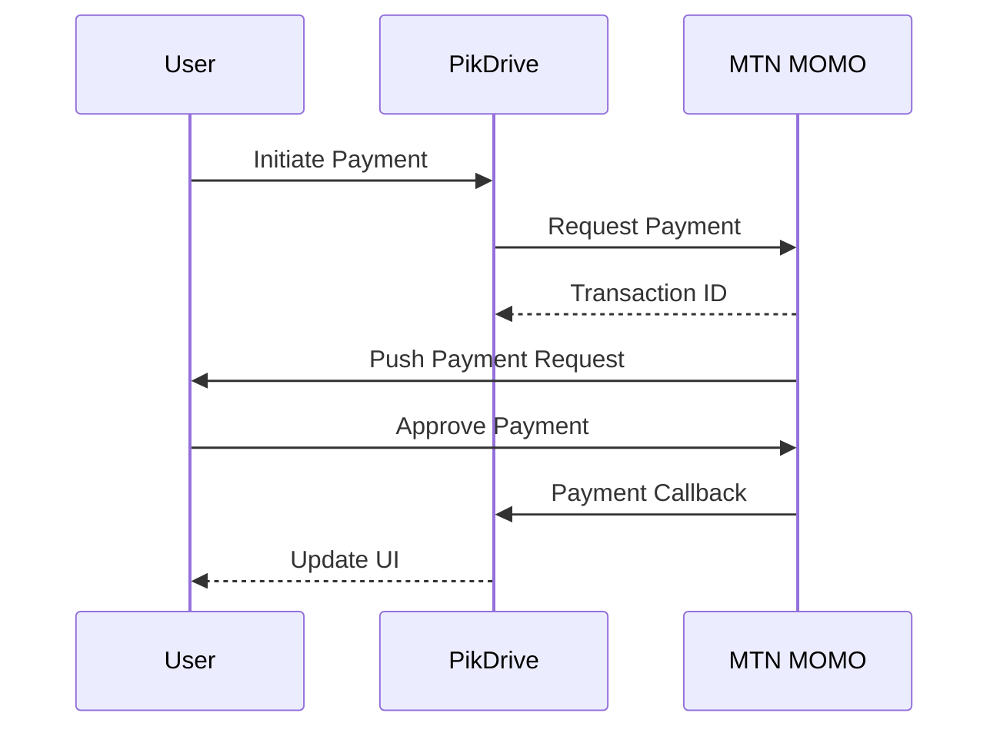

# MTN MOMO Integration Guide

## Overview
MTN Mobile Money (MOMO) integration uses their Collection API to request and receive payments. The flow uses a callback URL to receive payment status updates.

## API Flow



## Configuration

### Environment Variables
```bash
# Required variables
MOMO_SUBSCRIPTION_KEY=your_subscription_key
MOMO_API_KEY=your_api_key
MOMO_TARGET_ENVIRONMENT=sandbox|production
MOMO_CALLBACK_HOST=https://your-domain.com
MOMO_COLLECTION_PRIMARY_KEY=your_primary_key
MOMO_COLLECTION_USER_ID=your_user_id
```

### Callback URL
The callback URL must be:
1. Publicly accessible
2. HTTPS enabled
3. Set to: `${MOMO_CALLBACK_HOST}/api/payments/callback`

## Testing

### Sandbox Testing
```typescript
// Test phone number
const testNumber = '237670000000';

// Test amounts
const minAmount = 100;    // 100 XAF
const maxAmount = 500000; // 500,000 XAF
```

### Test Flow
1. Use test number: 237670000000
2. Payment will auto-succeed
3. Callback will be received
4. Status will update to 'completed'

### Production Testing
1. Use real MTN MOMO number
2. User must approve on phone
3. Real money will be transferred
4. Status updates via callback

## Error Handling

### Common Errors
1. Invalid phone number format
   ```typescript
   // Valid formats:
   "237670000000"
   "+237670000000"
   "670000000" // Will auto-prefix 237
   ```

2. Amount limits
   ```typescript
   // Must be within range:
   100 <= amount <= 500000
   ```

3. Network timeouts
   ```typescript
   // We retry up to 3 times with:
   - 5 second initial delay
   - Exponential backoff
   - Max 15 second delay
   ```

## Callback Handling

### Callback Format
```typescript
interface MOMOCallback {
  referenceId: string;        // Our transaction ID
  status: string;             // SUCCESSFUL, FAILED, PENDING
  reason?: string;            // Error reason if failed
  financialTransactionId?: string; // MTN's transaction ID
}
```

### Status Mapping
```typescript
const statusMap = {
  'SUCCESSFUL': 'completed',
  'FAILED': 'failed',
  'PENDING': 'processing'
} as const;
```

## Security

### Phone Number Validation
```typescript
function validatePhoneNumber(phone: string): boolean {
  // Must:
  // 1. Start with 237
  // 2. Be exactly 12 digits
  // 3. Match MTN prefixes
  return /^237(67|65|66|67|68)\d{7}$/.test(phone);
}
```

### Amount Validation
```typescript
function validateAmount(amount: number): boolean {
  return amount >= 100 && amount <= 500000;
}
```

## Monitoring

### Key Metrics
1. Payment success rate
2. Average processing time
3. Callback success rate
4. Error frequency

### Logging
```typescript
// We log:
1. Payment initiation
2. MTN API responses
3. Callback receipts
4. Status changes
5. Errors with full context
```

## Troubleshooting

### Payment Stuck in Pending
1. Check phone number format
2. Verify sufficient balance
3. Confirm network connectivity
4. Check callback URL accessibility

### Missing Callbacks
1. Verify callback URL
2. Check server logs
3. Confirm payment status manually
4. Contact MTN support if needed

### Invalid Responses
1. Check API credentials
2. Verify environment settings
3. Validate request format
4. Review error messages

## Support Contacts

### MTN MOMO Support
- Developer Portal: https://momodeveloper.mtn.com
- Support Email: momodeveloper@mtn.com
- API Documentation: https://momodeveloper.mtn.com/docs

### PikDrive Support
- Tech Lead: @jospen
- Support Email: support@pikdrive.com
- Internal Docs: /docs/payments/
