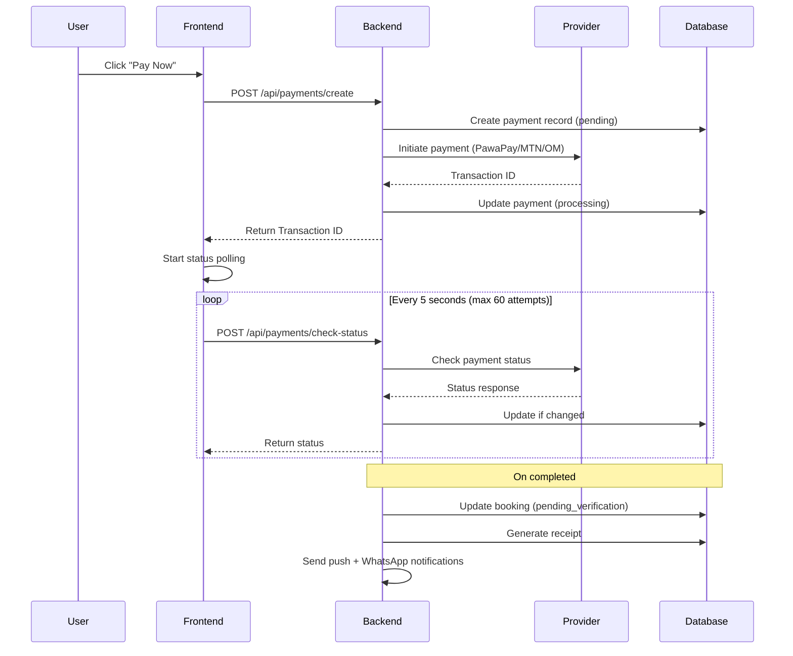
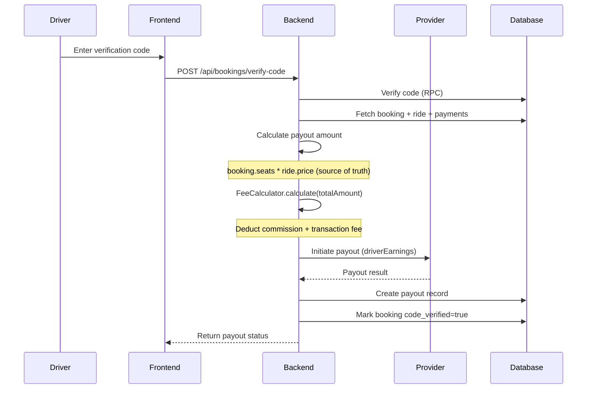
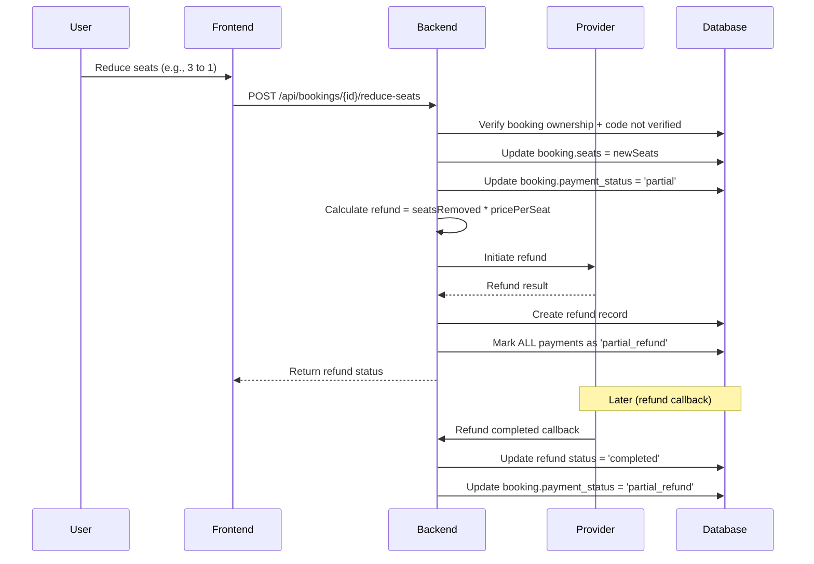

# Payment Flows

## 1. Payin Flow (Customer Pays)



### Key Files
- `app/api/payments/create/route.ts` — Payment initiation
- `app/api/payments/check-status/route.ts` — Status polling
- `lib/services/server/payment-creation-service.ts` — Provider routing
- `lib/services/server/payment-orchestration-service.ts` — Status change handling

---

## 2. Payout Flow (Driver Gets Paid)



### Key Files
- `lib/services/server/bookings/booking-payout-service.ts` — Payout logic
- `lib/payment/fee-calculator.ts` — Fee calculation

### Payout Calculation
```
totalAmount = booking.seats * ride.price
transactionFee = FeeCalculator.transactionFee(totalAmount)
commission = FeeCalculator.commission(totalAmount)
driverEarnings = totalAmount - transactionFee - commission
```

For partial bookings (seats reduced after refund), `booking.seats` is always the source of truth.

---

## 3. Refund Flow (Seat Reduction)



### Key Files
- `lib/services/server/bookings/booking-refund-service.ts` — Refund logic
- `app/api/bookings/[id]/reduce-seats/route.ts` — API endpoint
- `lib/services/server/refund-status-service.ts` — Refund callback handling

### Important: All payments are marked `partial_refund`
When a booking has multiple individual payments (e.g., user added seats one by one), ALL completed payments are marked as `partial_refund` during seat reduction — not just one. This prevents the payout service from overpaying the driver.

---

## Error Handling

### Common Errors
| Error | Cause | Resolution |
|-------|-------|------------|
| Invalid phone number | Wrong format | Must be 237XXXXXXXXX |
| Payment timeout | No response in 5 min | Marked as failed, user retries |
| Insufficient funds | User balance too low | User tops up and retries |
| Provider unavailable | API down | Retry or switch provider |

### Sandbox Testing
- PawaPay sandbox: Use test numbers from PawaPay dashboard
- MTN sandbox: `SANDBOX_MTN_TEST_PHONE` env var
- Amount limits: 100 - 500,000 XAF

---
Last Updated: February 2026
