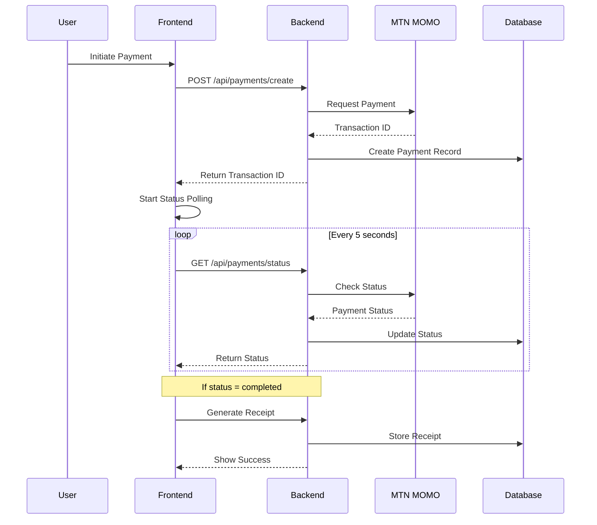

# Payment Flow

## Overview
PikDrive's payment system follows a robust flow to ensure reliable and traceable transactions. This document details each step of the payment process.

## Flow Diagram


## Step-by-Step Process

### 1. Payment Initiation
- User clicks "Pay Now" in booking modal
- Frontend collects:
  - Phone number
  - Amount (calculated from ride price × seats)
  - Booking ID

### 2. Payment Creation
```typescript
POST /api/payments/create
{
  phoneNumber: string;
  amount: number;
  bookingId: string;
}
```

### 3. Status Management
Status transitions follow this flow:
```
pending → processing → completed/failed
```

#### Status Checking Methods
1. **Frontend Polling**
   - Starts immediately after payment creation
   - Polls every 5 seconds
   - Maximum 60 attempts (5 minutes)

2. **Background Jobs**
   - Runs every 5 minutes
   - Checks stale pending payments
   - Updates status automatically

3. **Webhooks (Coming Soon)**
   - Instant status updates
   - More reliable than polling
   - Requires public endpoint

### 4. Receipt Generation
Automatically triggered when:
- Payment status becomes 'completed'
- Financial transaction ID is verified

## Error Handling

### Common Errors
1. **Invalid Phone Number**
   - Must be in format: 237XXXXXXXXX
   - Must be active MTN number

2. **Payment Timeout**
   - After 5 minutes of pending status
   - Marked as failed
   - User must retry

3. **Network Issues**
   - Automatic retry mechanism
   - Maximum 3 retries
   - Exponential backoff

## Testing

### Sandbox Testing
1. Use test number: 237670000000
2. Amount limits: 100-500,000 XAF
3. Instant success flow available

### Production Testing
1. Real MTN MOMO account required
2. Test with small amounts first
3. Monitor transaction logs

## Monitoring

### Key Metrics
1. Payment Success Rate
2. Average Processing Time
3. Error Rate by Type
4. Stale Payment Count

### Alerts
Set up alerts for:
1. High failure rate
2. Increased processing time
3. Stale payments > 15 minutes
4. API errors

## Maintenance Tasks

### Daily
1. Monitor error logs
2. Check stale payments
3. Verify webhook health

### Weekly
1. Review success rates
2. Check performance metrics
3. Update test cases

### Monthly
1. Audit payment records
2. Update documentation
3. Review security measures
